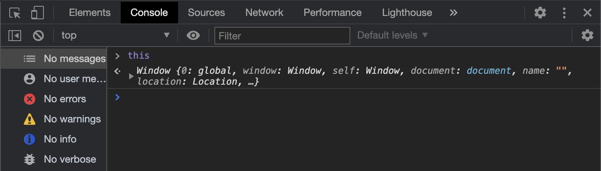

### Why I decided to blog about "this":

I'm a big fan of the <a href="https://syntax.fm" target="_blank">Syntax.fm</a> podcast by <a href="https://wesbos.com" target="_blank">Wes Bos</a> and <a href="https://leveluptutorials.com" target="_blank">Scott Tolinski</a>, and I remember hearing an episode where Wes said something to the point of a developer really needing to build a site around the JavaScript `this` keyword due to the mysterious output we developers so often get when attempting to use it in various contexts.

Of course, there is a plethora of documentation on the topic already, and I don't intend to outshine any of that (I do love the MDN Web Docs). Rather, this blog series along with my site <a href="https://usethis.dev" target="_blank">usethis.dev</a> will hopefully be able to accomplish centralizing articles and documentation, as well as provide opportunities for developers to quiz themselves on content discussed.

So without any further introduction, let's get started!

### What we'll be learning in this series:

We'll be learning the basics of the JavaScript `this` keyword in various contexts, the use of bind, the window object, block and function scope, and the difference between regular functions and arrow functions (and, in turn, the effects they have on the `this` keyword).


### What we'll be learning in this post:

Today, we will be discussing the global `window` object, block and function scope, JavaScript data types, and gaining a general understanding of what `this` will output in a given environment.

---

# This in Action

\
As a brief overview, here is a succinct statement on the topic of `this` from the MDN Web Docs:

> In most cases, the value of this is determined by how a function is called (runtime binding).
>
> -- <a href="https://developer.mozilla.org/en-US/docs/Web/JavaScript/Reference/Operators/this" target="_blank">MDN</a>

While it may seem deceivingly simple, the `this` keyword is not like other keywords in JavaScript. It is completely determined on where it is called. For example, in the code below, we have used `this` not in a function, but simply within a bare HTML script tag.

```html
<script>
  console.log(this) // Window { window: Window, self: Window, document, name: "..."} etc.
</script>
```

You can also get the same result by opening up the developer tools in any browser, go to the console tab, and enter `this` as shown below in Chrome:



The reasoning behind the following output is that there is no other <u>_object_</u> (remember this key term for later) encapsulating the `this` keyword from which it will assume that environment. Only the window object is encapsulating the `this` keyword.

To further explain this, let's look at a couple other examples:

#### Examples

```js
// Example 1
const wrapperFunction = function () {
  console.log(this)
}

// Example 2
const wrapperObjectWithFunction = {
  key: function () {
    console.log(this)
  },
}
```

What do you think these will output? Take a moment before scrolling down to view the answer.

What

---

\
&nbsp;&nbsp;&nbsp;&nbsp;&nbsp;&nbsp;&nbsp;&nbsp;&nbsp;&nbsp;&nbsp;&nbsp;Are

---

\
&nbsp;&nbsp;&nbsp;&nbsp;&nbsp;&nbsp;&nbsp;&nbsp;&nbsp;&nbsp;&nbsp;&nbsp;&nbsp;&nbsp;&nbsp;&nbsp;&nbsp;&nbsp;&nbsp;&nbsp;&nbsp;&nbsp;&nbsp;&nbsp;The

---

\
&nbsp;&nbsp;&nbsp;&nbsp;&nbsp;&nbsp;&nbsp;&nbsp;&nbsp;&nbsp;&nbsp;&nbsp;&nbsp;&nbsp;&nbsp;&nbsp;&nbsp;&nbsp;&nbsp;&nbsp;&nbsp;&nbsp;&nbsp;&nbsp;&nbsp;&nbsp;&nbsp;&nbsp;&nbsp;&nbsp;&nbsp;&nbsp;&nbsp;&nbsp;&nbsp;&nbsp;Answers

---

\
&nbsp;&nbsp;&nbsp;&nbsp;&nbsp;&nbsp;&nbsp;&nbsp;&nbsp;&nbsp;&nbsp;&nbsp;&nbsp;&nbsp;&nbsp;&nbsp;&nbsp;&nbsp;&nbsp;&nbsp;&nbsp;&nbsp;&nbsp;&nbsp;&nbsp;&nbsp;&nbsp;&nbsp;&nbsp;&nbsp;&nbsp;&nbsp;&nbsp;&nbsp;&nbsp;&nbsp;&nbsp;&nbsp;&nbsp;&nbsp;&nbsp;&nbsp;&nbsp;&nbsp;&nbsp;&nbsp;&nbsp;&nbsp;Going

---

\
&nbsp;&nbsp;&nbsp;&nbsp;&nbsp;&nbsp;&nbsp;&nbsp;&nbsp;&nbsp;&nbsp;&nbsp;&nbsp;&nbsp;&nbsp;&nbsp;&nbsp;&nbsp;&nbsp;&nbsp;&nbsp;&nbsp;&nbsp;&nbsp;&nbsp;&nbsp;&nbsp;&nbsp;&nbsp;&nbsp;&nbsp;&nbsp;&nbsp;&nbsp;&nbsp;&nbsp;&nbsp;&nbsp;&nbsp;&nbsp;&nbsp;&nbsp;&nbsp;&nbsp;&nbsp;&nbsp;&nbsp;&nbsp;&nbsp;&nbsp;&nbsp;&nbsp;&nbsp;&nbsp;&nbsp;&nbsp;&nbsp;&nbsp;&nbsp;&nbsp;To

---

\
&nbsp;&nbsp;&nbsp;&nbsp;&nbsp;&nbsp;&nbsp;&nbsp;&nbsp;&nbsp;&nbsp;&nbsp;&nbsp;&nbsp;&nbsp;&nbsp;&nbsp;&nbsp;&nbsp;&nbsp;&nbsp;&nbsp;&nbsp;&nbsp;&nbsp;&nbsp;&nbsp;&nbsp;&nbsp;&nbsp;&nbsp;&nbsp;&nbsp;&nbsp;&nbsp;&nbsp;&nbsp;&nbsp;&nbsp;&nbsp;&nbsp;&nbsp;&nbsp;&nbsp;&nbsp;&nbsp;&nbsp;&nbsp;&nbsp;&nbsp;&nbsp;&nbsp;&nbsp;&nbsp;&nbsp;&nbsp;&nbsp;&nbsp;&nbsp;&nbsp;&nbsp;&nbsp;&nbsp;&nbsp;&nbsp;&nbsp;&nbsp;&nbsp;&nbsp;&nbsp;&nbsp;&nbsp;Be

---

\
&nbsp;&nbsp;&nbsp;&nbsp;&nbsp;&nbsp;&nbsp;&nbsp;&nbsp;&nbsp;&nbsp;&nbsp;&nbsp;&nbsp;&nbsp;&nbsp;&nbsp;&nbsp;&nbsp;&nbsp;&nbsp;&nbsp;&nbsp;&nbsp;&nbsp;&nbsp;&nbsp;&nbsp;&nbsp;&nbsp;&nbsp;&nbsp;&nbsp;&nbsp;&nbsp;&nbsp;&nbsp;&nbsp;&nbsp;&nbsp;&nbsp;&nbsp;&nbsp;&nbsp;&nbsp;&nbsp;&nbsp;&nbsp;&nbsp;&nbsp;&nbsp;&nbsp;&nbsp;&nbsp;&nbsp;&nbsp;&nbsp;&nbsp;&nbsp;&nbsp;&nbsp;&nbsp;&nbsp;&nbsp;&nbsp;&nbsp;&nbsp;&nbsp;&nbsp;&nbsp;&nbsp;&nbsp;&nbsp;&nbsp;&nbsp;&nbsp;&nbsp;&nbsp;&nbsp;&nbsp;&nbsp;&nbsp;&nbsp;&nbsp;&nbsp;&nbsp;&nbsp;&nbsp;&nbsp;&nbsp;Here?

#### Results

```js
// Example 1
const wrapperFunction = function () {
  console.log(this) // Window { window: Window, self: Window, document, name: "..."} etc.
}

// Example 2
const wrapperObject = {
  log: function () {
    console.log(this) // {log: ƒ}
  },
}
```

You might be surprised to see that in our first example, what is logged out is once again the `window` object. Now, why is that?

We must first understand that JavaScript variables can contain expressions. A simple yet pointless expression could be

```js
const sum = 1 + 1 // 2
```

A common misconception in metaphor that many programmers have is thinking of variables as a box "holding" a value (i.e. sum holding the value of 2).

Instead, variables act rather as <u>pointers</u>. Variables point to either _primitives_ (i.e. string, number, boolean, bigint, symbol, undefined, or null), _functions_, or _objects_. (If you'd like to go deeper in this topic rather than get a 10,000 foot view, you should definitely check <a href="https://twitter.com/dan_abramov" target="_blank">Dan Abramov's</a> course <a href="https://justjavascript.com" target="_blank">Just JavaScript</a>)

Thus, when we are logging `this` within a function we are not in fact logging out the variables assigned the function. That would be a bit of an oxymoron since the variable is the evaluation of an expression. Put simply, a function is really just a group of expressions to perform a particular task. Thus, it would make sense that we get the `window` object in the first example since the variable is defined within the global scope.

Remember what we said about variables being pointers to either _primitives_, _functions_, or _objects_? Well, the same attribute stands for object keys. In the second example, the `log` key is pointing to the function with the `console.log` method. The only difference is objects create their own block scope which changes the value of `this`. In this instance, the function is being pointed to by the log key which is defined within the object pointed to by the objectWrapper variable. As a result, the function is not bound to the global window object but instead it is tied locally to the object it is defined, which is why we are logging out an object containing the key `{log: f}`

In our next article, we will be looking further at the difference the `this` keyword has within arrow functions as well as the implications block scope has with different variables.
